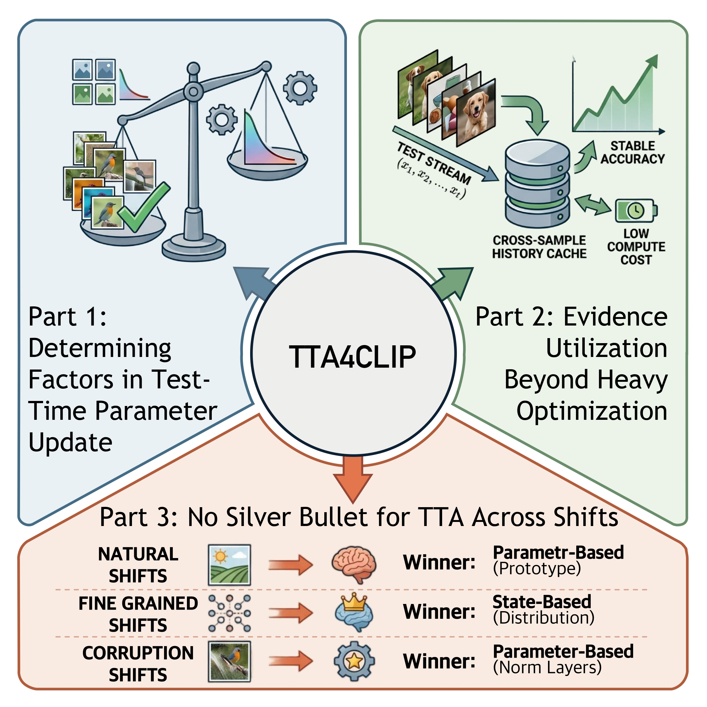
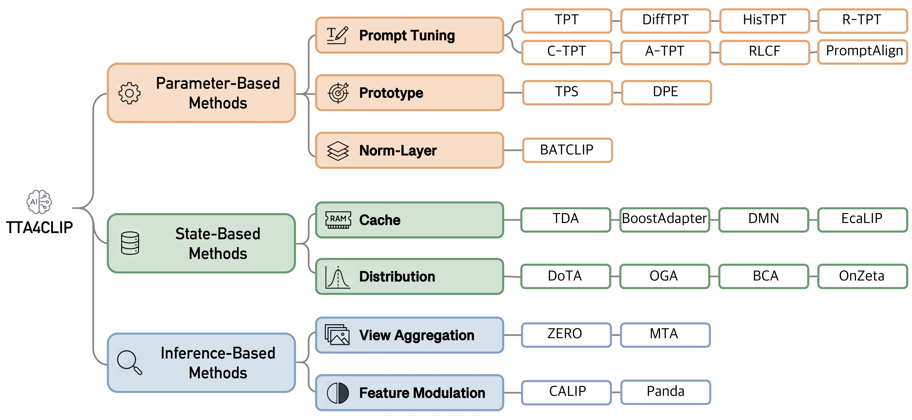

# TTABC: Test-Time Adaptation Benchmark of CLIP (NeurIPS 2026)

<p align="center">
  <a href="https://github.com/walawalagoose/TTABC">
    
  </a>
  <a href="https://github.com/walawalagoose/TTABC">
    
  </a>
  <a href="https://arxiv.org/abs/2606.14299">
    
  </a>
  <a href="https://walawalagoose.github.io/TTABC/">
    
  </a>
</p>

This is an open source Test-Time Adaptation Benchmark of CLIP repository based on PyTorch, also the official repository of the paper *[What Drives Test-Time Adaptation for CLIP? A Controlled Empirical Study from an Update Perspective
](https://arxiv.org/abs/2606.14299)*, accepted by NeurIPS 2026 E&D Track.

<!--
The implementation is built upon [TPT](https://github.com/azshue/TPT) and inspired by [TTAB](https://github.com/lins-lab/ttab).
-->

## 🐏 Overview

<details>
  <summary><strong>Abstract</strong></summary>

  Vision-Language Models (VLMs) such as CLIP have become a standard backbone for open-vocabulary recognition, yet their zero-shot predictions remain vulnerable to distribution shifts encountered at deployment. 
    Test-Time Adaptation (TTA) has recently been extended to CLIP as a lightweight solution, leading to a rapidly growing body of TTA4CLIP methods. 
    However, empirical progress in this area has largely outpaced our understanding of what truly drives adaptation, where their gains originate, and under which shifts they remain reliable. 
    In this paper, we take a step back from the pursuit of state-of-the-art accuracy and conduct a systematic controlled study of TTA4CLIP. 
    We first organize existing methods into three unified paradigms according to \emph{what is updated} at test time. 
    We then introduce TTABC, an open-source TTA Benchmark for CLIP, which standardizes evaluation protocols and integrates more than 20 representative methods. 
    Our controlled empirical analysis focuses on three key areas. First, we determine the driving factors in parameter-based methods, revealing that adaptation gains are primarily driven by test-time evidence and reliable proxies rather than heavy optimization. Second, we explore evidence utilization beyond heavy parameter tuning, showing that competitive and efficient performance can be achieved through cross- or current-sample evidence and lightweight prototype updates. Finally, we demonstrate that there is no silver bullet for TTA: no single adaptation paradigm is universally optimal, and the preferred paradigm depends on the nature of shift. 
    We hope our benchmark and study provide a clearer understanding of the current TTA4CLIP landscape and establish a foundation for further research. 

</details>

Our study incorporates three key parts:

* **Part 1: Determining factors in test-time parameter update.** Heavy parameter optimization yields limited and diminishing returns; instead, adaptation gains are primarily driven by the test-time evidence and reliable proxies.

* **Part 2: Evidence utilization beyond heavy optimization.** Competitive and efficient performance can be achieved through prediction refinement from cross/current-sample evidence or lightweight prototype residual updates, bypassing the need for heavy parameter optimization.

* **Part 3: No silver bullet for TTA across shifts.** No single adaptation paradigm is universally optimal. The preferred paradigm largely depends on the nature of the shift.


<p align="center">
  
</p>

## 📑 TTABC Taxonomy

Despite their diverse implementations, existing TTA4CLIP methods can be systematically categorized according to **what is updated at test time**. Specifically, we organize them into three paradigms: **parameter-based methods**, which adapt model parameters through gradient-based optimization; **state-based methods**, which keep model parameters frozen and instead update external states by accumulating historical evidence from the test stream; and **inference-based methods**, which update neither parameters nor external states, but directly refine predictions using currently available evidence during the forward pass.

The taxonomy is illustrated below.

<p align="center">
  
</p>

The [currently available algorithms](https://github.com/walawalagoose/TTABC_basic/tree/main/ttabc/model_selection) are:

<details>
  <summary><strong>Available Algorithms</strong></summary>

### Zero-Shot Baseline

* Learning Transferable Visual Models From Natural Language Supervision (Zero-Shot CLIP, [Alec Radford et al., 2021](https://arxiv.org/abs/2103.00020))

### Parameter-based Methods

**Prompt Learning**

* Test-Time Prompt Tuning for Zero-Shot Generalization in Vision-Language Models (TPT, [Manli Shu et al., 2022](https://arxiv.org/abs/2209.07511))
* Diverse Data Augmentation with Diffusions for Effective Test-time Prompt Tuning (DiffTPT, [Chun-Mei Feng et al., 2023](https://arxiv.org/abs/2308.06038))
* Historical Test-time Prompt Tuning for Vision Foundation Models (HisTPT, [Jingyi Zhang et al., 2024](https://arxiv.org/abs/2410.20346))
* C-TPT: Calibrated Test-Time Prompt Tuning for Vision-Language Models via Text Feature Dispersion (C-TPT, [Hee Suk Yoon et al., 2024](https://arxiv.org/abs/2403.14119))
* A-TPT: Angular Diversity Calibration Properties for Test-Time Prompt Tuning of Vision-Language Models (A-TPT, [Syed Ashar Ahamed et al., 2025](https://arxiv.org/abs/2510.26441))
* R-TPT: Improving Adversarial Robustness of Vision-Language Models through Test-Time Prompt Tuning (R-TPT, [Lijun Sheng et al., 2025](https://arxiv.org/abs/2504.11195))
* Align Your Prompts: Test-Time Prompting with Distribution Alignment for Zero-Shot Generalization (PromptAlign, [Jameel Hassan Abdul Samadh et al., 2023](https://arxiv.org/abs/2311.01459))
* Test-Time Adaptation with CLIP Reward for Zero-Shot Generalization in Vision-Language Models (RLCF, [Shuai Zhao et al., 2023](https://arxiv.org/abs/2305.18010))

**Prototype**

* Just Shift It: Test-Time Prototype Shifting for Zero-Shot Generalization with Vision-Language Models (TPS, [Elaine Sui et al., 2025](https://arxiv.org/abs/2403.12952))
* Dual Prototype Evolving for Test-Time Generalization of Vision-Language Models (DPE, [Ce Zhang et al., 2024](https://arxiv.org/abs/2410.12790))

**Norm Layer**

* BATCLIP: Bimodal Online Test-Time Adaptation for CLIP (BATCLIP, [Sanket K. Maharana et al., 2024](https://arxiv.org/abs/2412.02837))

### State-based Methods

**Cache**

* Efficient Test-Time Adaptation of Vision-Language Models (TDA, [Adilbek Karmanov et al., 2024](https://arxiv.org/abs/2403.18293))
* BoostAdapter: Improving Vision-Language Test-Time Adaptation via Regional Bootstrapping (BoostAdapter, [Taolin Zhang et al., 2024](https://arxiv.org/abs/2410.15430))
* Dual Memory Networks: A Versatile Adaptation Approach for Vision-Language Models (DMN, [Yabin Zhang et al., 2024](https://arxiv.org/abs/2403.17589))
* Efficient and Context-Aware Label Propagation for Zero-/Few-Shot Training-Free Adaptation of Vision-Language Model (ECALP, [Yushu Li et al., 2024](https://arxiv.org/abs/2412.18303))

**Distribution**

* DOTA: DistributiOnal Test-time Adaptation of Vision-Language Models (DoTA, [Zongbo Han et al., 2024](https://arxiv.org/abs/2409.19375))
* Online Gaussian Test-Time Adaptation of Vision-Language Models (OGA, [Clément Fuchs et al., 2025](https://arxiv.org/abs/2501.04352))
* Bayesian Test-Time Adaptation for Vision-Language Models (BCA, [Lihua Zhou et al., 2025](https://arxiv.org/abs/2503.09248))
* Online Zero-Shot Classification with CLIP (OnZeta, [Qi Qian and Juhua Hu, 2024](https://arxiv.org/abs/2408.13320))

### Inference-based Methods

**View Aggregation**

* Frustratingly Easy Test-Time Adaptation of Vision-Language Models (ZERO, [Matteo Farina et al., 2024](https://arxiv.org/abs/2405.18330))
* On the Test-Time Zero-Shot Generalization of Vision-Language Models: Do We Really Need Prompt Learning? (MTA, [Maxime Zanella and Ismail Ben Ayed, 2024](https://arxiv.org/abs/2405.02266))

**Feature Modulation**

* CALIP: Zero-Shot Enhancement of CLIP with Parameter-free Attention (CALIP, [Ziyu Guo et al., 2023](https://arxiv.org/abs/2209.14169))

* Panda: Test-Time Adaptation with Negative Data Augmentation (Panda, [Ruxi Deng et al., 2026](https://arxiv.org/abs/2511.10481))

* *More to be updated...*

</details>

Send us a PR to add your algorithm!


## 🏔️ Available datasets

Our evaluation focuses on 

1) Fine-grained classification: ImageNet, Flower102, OxfordPets, SUN397, DTD, Food101, StanfordCars, Aircraft, UCF101, EuroSAT, Caltech101

2) Natural distribution shift: ImageNet-V2, ImageNet-A, ImageNet-R, ImageNet-Sketch

3) Corruptions: ImageNet-C

Prepare the datasets based on the following link [TPT](https://github.com/azshue/TPT).
The download links of currently available datasets are:

<details>
<summary>Download link</summary>

+ [Imagenet-A](https://people.eecs.berkeley.edu/~hendrycks/imagenet-a.tar)
+ [ImageNet-V2](https://huggingface.co/datasets/vaishaal/ImageNetV2/tree/main)
+ [Imagenet-R](https://people.eecs.berkeley.edu/~hendrycks/imagenet-r.tar)
+ [Imagenet-Sketch](https://www.kaggle.com/datasets/wanghaohan/imagenetsketch)
+ [CIFAR-10-C](https://zenodo.org/records/2535967/files/CIFAR-10-C.tar?download=1)
+ [CIFAR-100-C](https://zenodo.org/records/3555552/files/CIFAR-100-C.tar?download=1)
+ [ImageNet-C](https://zenodo.org/records/2235448)
+ [Flower102](https://www.robots.ox.ac.uk/~vgg/data/flowers/102/102flowers.tgz)
+ [DTD](https://www.robots.ox.ac.uk/~vgg/data/dtd/download/dtd-r1.0.1.tar.gz)
+ [OxfordPets](https://www.robots.ox.ac.uk/~vgg/data/pets/data/images.tar.gz)
+ [StanfordCars](https://ai.stanford.edu/~jkrause/cars/car_dataset.html)
+ [UCF101](https://drive.google.com/file/d/10Jqome3vtUA2keJkNanAiFpgbyC9Hc2O/view?usp=sharing)
+ [Caltech101](http://www.vision.caltech.edu/Image_Datasets/Caltech101/101_ObjectCategories.tar.gz)
+ [Food101](http://data.vision.ee.ethz.ch/cvl/food-101.tar.gz)
+ [SUN397](http://vision.princeton.edu/projects/2010/SUN/SUN397.tar.gz)
+ [Aircraft](https://www.robots.ox.ac.uk/~vgg/data/fgvc-aircraft/archives/fgvc-aircraft-2013b.tar.gz)
+ [EuroSAT](http://madm.dfki.de/files/sentinel/EuroSAT.zip)
+ *More to be updated...*

</details>

<details>
<summary>Dataset path</summary>

> /path/to/your/data/root  
> ├── Aircraft  
> ├── Caltech101  
> ├── CIFAR-10  
> ├── CIFAR-100  
> ├── cifar10_c  
> ├── cifar100_c  
> ├── DTD  
> ├── EuroSAT  
> ├── Flower102  
> ├── Food101  
> ├── ImageNet  
> ├── imagenet-a  
> ├── imagenet-c  
> ├── imagenet-r  
> ├── ImageNet-Sketch  
> ├── imagenetv2-matched-frequency-format-val  
> ├── OxfordPets  
> ├── StanfordCars  
> ├── SUN397  
> ├── UCF101

</details>

## 💭 Installation
```bash

# Clone this repo
git clone https://github.com/walawalagoose/TTABC.git
cd TTABC

# Create a conda enviroment
conda create -n ttabc python=3.10 -y
conda activate ttabc

# Install PyTorch. Below is a sample command to do this, but you should check the following link
# to find installation instructions that are specific to your compute platform:
# https://pytorch.org/get-started/locally/
pip3 install torch torchvision torchaudio --index-url https://download.pytorch.org/whl/cu128 # UPDATE ME!

pip install -r requirements.txt

```

## 👀 Running Experiments

In each of the .sh files, change the `{data_root}` accordingly. Additionally, you can change the CLIP architecture by modifying the `{arch}` parameter to either `RN50` or `ViT-B/16`. By changing `{run_type}`, you can select a method, such as `tpt`, `ctpt`, `otpt`, or other supported methods.

An example to run TPT:

```bash

bash ./test_ds_example.sh R # test on imgenet-r
bash ./test_ds_example.sh I/A/V/R/K # test on imgenet, imgenet-a, imgenet-v, imgenet-r and imgenet-k

```

The command line argument `{dataset}` can be specified as follows: `I`, `DTD`, `Flower102`, `Food101`, `StanfordCars`, `SUN397`, `Aircraft`, `OxfordPets`, `Caltech101`, `UCF101`, or `EuroSAT` for fine-grained classification datasets, and `V2`, `A`, `R`, or `K` for datasets with natural distribution shifts.

## 👾 Adding a new method

First, create a `newMethod.py` file under `./ttabc/model_selection`. In this file, create the class `newMethod` and make it inherit from `./ttabc/model_selection/base_method.BaseMethod`. Make sure that the functions `test_time_tuning` and `test_time_adapt_eval` have been implemented.

Then, add the dictionary key for `newMethod` and its corresponding return value in `./ttabc/model_selection/__init__.py`.

Finally, add a `choices` option to `--run_type` in `./main.py` and implement the corresponding operation in `main_worker`.

## ♥️ Acknowledgement

We thank the authors of [CoOp/CoCoOp](https://github.com/KaiyangZhou/CoOp) and [TPT](https://github.com/azshue/TPT) for their open-source contributions and their assistance with the data preparation, the authors of [TTAB](https://github.com/lins-lab/ttab) for inspiration of this work. 

## 🀄️ Citation
If you find our work useful in your research, please cite:
```
@article{huang2026drives,
  title={What Drives Test-Time Adaptation for CLIP? A Controlled Empirical Study from an Update Perspective},
  author={Huang, Jiazhen and Chen, Xiao and Liu, Zhiming and Sun, Yaru and Jiang, Jingyan and Wang, Zhi},
  journal={arXiv preprint arXiv:2606.14299},
  year={2026}
}

```

## ☎️ Contact

If you have any questions, please feel free to [email](mailto:huangjiazhen1125@gmail.com) me.
